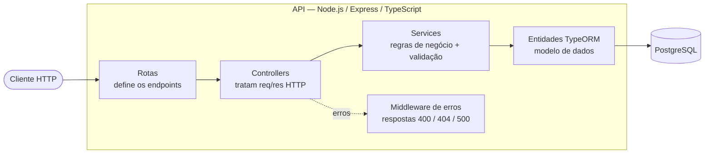
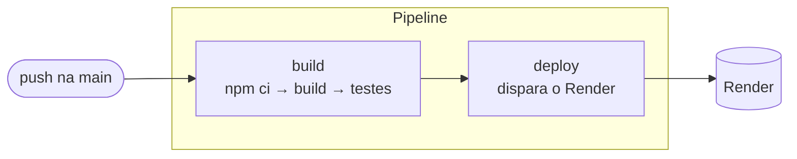

# Tech Challenge — API de Blog Academico

API REST para uma plataforma de blog Academico dinâmico voltada a **professores(as) e
alunos(as) da rede pública de educação**. Este projeto é a refatoração do back-end
(originalmente construído em OutSystems) para uma stack moderna em **Node.js +
Express + TypeScript**, com persistência em **PostgreSQL** via **TypeORM**,
containerizado com **Docker** e com pipeline de **CI/CD no GitHub Actions**.

> 🌐 **Aplicação publicada:** `https://<sua-app>.onrender.com` _(preencher com a URL do Render após o deploy)_

## Sumário

- [Arquitetura do sistema](#arquitetura-do-sistema)
- [Tecnologias](#tecnologias)
- [Como executar](#como-executar)
- [Uso da aplicação (endpoints)](#uso-da-aplicação-endpoints)
- [Testes e cobertura](#testes-e-cobertura)
- [CI/CD (GitHub Actions)](#cicd-github-actions)
- [Relato de experiências e desafios](#relato-de-experiências-e-desafios)
- [Próximos passos](#próximos-passos)

---

## Arquitetura do sistema

A aplicação segue uma **arquitetura em camadas**, separando responsabilidades para
facilitar manutenção e testes. Cada requisição percorre o caminho:



**Responsabilidade de cada camada:**

| Camada | Papel | Arquivos |
| --- | --- | --- |
| **Rotas** | Mapeiam URL + método HTTP para um controller | `src/routes/` |
| **Controllers** | Recebem a requisição, chamam o service e devolvem a resposta | `src/controllers/` |
| **Services** | Concentram as regras de negócio (validação, "não encontrado", busca) | `src/services/` |
| **Entidades** | Modelo de dados mapeado para a tabela via TypeORM | `src/entities/` |
| **Middlewares** | Tratamento central de erros e rota 404 | `src/middlewares/` |
| **Config** | `DataSource` do TypeORM (conexão com o banco) | `src/config/` |

### Estrutura de pastas

```
.
├── src/
│   ├── config/          # DataSource do TypeORM (conexão)
│   ├── entities/        # Entidade Post (modelo de dados)
│   ├── services/        # Regras de negócio (PostService)
│   ├── controllers/     # Handlers HTTP (PostController)
│   ├── routes/          # Definição das rotas
│   ├── middlewares/     # errorHandler + notFound
│   ├── errors/          # Classe AppError (erro com status HTTP)
│   ├── app.ts           # Configuração do Express
│   └── server.ts        # Ponto de entrada (conecta ao banco e sobe o servidor)
├── tests/               # Testes unitários (Jest)
├── .github/workflows/   # Pipeline de CI/CD (GitHub Actions)
├── Dockerfile           # Imagem da API (multi-stage build)
├── docker-compose.yml   # Orquestra API + PostgreSQL
└── requests.http        # Requisições prontas para teste manual
```

### Modelo de dados

A entidade **`Post`** (tabela `posts`):

| Campo | Tipo | Observação |
| --- | --- | --- |
| `id` | UUID | chave primária gerada automaticamente |
| `title` | varchar(255) | título do post |
| `content` | text | conteúdo completo |
| `author` | varchar(120) | autor (docente) |
| `created_at` | timestamp | preenchido automaticamente |
| `updated_at` | timestamp | atualizado automaticamente a cada edição |

---

## Tecnologias

- **Node.js** + **Express** — servidor e roteamento
- **TypeScript** — tipagem estática
- **TypeORM** — ORM e mapeamento das entidades
- **PostgreSQL** — banco de dados relacional
- **Jest** + **ts-jest** — testes unitários e cobertura
- **Docker** / **Docker Compose** — containerização
- **GitHub Actions** — CI/CD
- **Render** — hospedagem (deploy)

---

## Como executar

Há duas formas. A **via Docker é a recomendada** — sobe tudo (API + banco) com um comando, sem instalar Node ou PostgreSQL na máquina.

### Opção A — Docker Compose (recomendada)

Pré-requisito: **Docker Desktop** instalado e em execução.

```bash
docker compose up --build
```

Isso sobe:
- **`blog-db`** — PostgreSQL (exposto na porta **5433** do host, para não conflitar com um Postgres local na 5432);
- **`blog-api`** — a API, acessível em **http://localhost:3000**.

Para parar: `Ctrl + C` ou `docker compose down` (os dados do banco ficam salvos no volume).

### Opção B — Local, sem Docker

Pré-requisitos: **Node.js 18+** e um **PostgreSQL** em execução.

```bash
# 1. Instalar dependências
npm install

# 2. Criar o .env a partir do exemplo e ajustar as credenciais
cp .env.example .env

# 3. Rodar em desenvolvimento (hot reload)
npm run dev
```

Com `DB_SYNCHRONIZE=true`, a tabela `posts` é criada automaticamente ao subir a aplicação.

### Variáveis de ambiente

| Variável | Padrão | Descrição |
| --- | --- | --- |
| `PORT` | `3000` | Porta do servidor |
| `DB_HOST` | `localhost` | Host do banco (`db` no Docker Compose) |
| `DB_PORT` | `5432` | Porta do banco |
| `DB_USERNAME` | `postgres` | Usuário |
| `DB_PASSWORD` | `postgres` | Senha |
| `DB_DATABASE` | `blog` | Nome do banco |
| `DB_SYNCHRONIZE` | `true` | Cria/atualiza tabelas a partir das entidades (usar só em dev) |
| `DB_LOGGING` | `false` | Loga as queries SQL |

> ⚠️ O arquivo `.env` **não é versionado** (está no `.gitignore`), pois contém credenciais. Use o `.env.example` como referência.

---

## Uso da aplicação (endpoints)

Base URL local: `http://localhost:3000`

| Método | Rota | Descrição |
| --- | --- | --- |
| `GET` | `/posts` | Lista todas as postagens |
| `GET` | `/posts/search?q=termo` | Busca posts por palavra-chave (no título ou conteúdo) |
| `GET` | `/posts/:id` | Retorna uma postagem pelo id |
| `POST` | `/posts` | Cria uma nova postagem |
| `PUT` | `/posts/:id` | Edita uma postagem existente |
| `DELETE` | `/posts/:id` | Exclui uma postagem |
| `GET` | `/health` | Healthcheck da aplicação |

### Corpo da requisição (POST / PUT)

```json
{
  "title": "Aula de História",
  "content": "Conteúdo completo sobre a Revolução Francesa...",
  "author": "Prof. Maria"
}
```

### Exemplo de resposta (201 Created)

```json
{
  "id": "3841afa9-e48e-4afd-8728-87307ff9bf97",
  "title": "Aula de História",
  "content": "Conteúdo completo sobre a Revolução Francesa...",
  "author": "Prof. Maria",
  "createdAt": "2026-07-14T21:33:04.854Z",
  "updatedAt": "2026-07-14T21:33:04.854Z"
}
```

### Respostas de erro

| Situação | Status | Corpo |
| --- | --- | --- |
| Campos obrigatórios ausentes/vazios | `400` | `{ "error": "Campos obrigatorios ausentes ou vazios: ..." }` |
| Post não encontrado | `404` | `{ "error": "Post com id \"...\" nao encontrado." }` |
| Erro interno | `500` | `{ "error": "Erro interno do servidor." }` |

### Exemplos com curl

```bash
# Criar
curl -X POST http://localhost:3000/posts \
  -H "Content-Type: application/json" \
  -d '{"title":"Aula de Historia","content":"Revolucao Francesa...","author":"Prof. Maria"}'

# Listar
curl http://localhost:3000/posts

# Buscar
curl "http://localhost:3000/posts/search?q=revolucao"

# Ler por id
curl http://localhost:3000/posts/<id>

# Editar
curl -X PUT http://localhost:3000/posts/<id> \
  -H "Content-Type: application/json" \
  -d '{"content":"Conteudo atualizado"}'

# Excluir
curl -X DELETE http://localhost:3000/posts/<id>
```

> 💡 Há também o arquivo **`requests.http`** na raiz: abra no VS Code com a extensão **REST Client** e clique em "Send Request" para testar cada endpoint.

---

## Testes e cobertura

Testes unitários com **Jest**, focados nas regras de negócio (criação, edição, exclusão e busca).
O repositório do banco é *mockado*, então os testes **rodam sem precisar de um PostgreSQL**.

```bash
npm test          # roda os testes com relatório de cobertura
npm run test:watch  # modo interativo (re-roda ao salvar)
```

- **12 testes** cobrindo as funções críticas.
- Cobertura global de **~44%** — acima do mínimo de **20%** exigido.
- O `jest.config.js` trava um `coverageThreshold` de 20%: se a cobertura cair abaixo, o comando (e o CI) **falha**.

---

## CI/CD (GitHub Actions)

O workflow em `.github/workflows/main.yml` roda a cada `push` e `pull request` na branch `main`:



- **`build`** — instala dependências (`npm ci`), compila o TypeScript e roda os testes com cobertura.
- **`deploy`** — só executa após o `build` passar; dispara o deploy no **Render** via *Deploy Hook*
  (armazenado como secret `RENDER_DEPLOY_HOOK`). Enquanto o secret não estiver configurado, o job
  pula com segurança, sem quebrar o pipeline.

---

## Relato de experiências e desafios

Esta seção documenta a experiência do grupo ao longo do desenvolvimento e os principais
obstáculos enfrentados — e como foram resolvidos.

### Da OutSystems ao Node.js

O maior salto foi conceitual: sair de uma plataforma *low-code* (OutSystems), onde muita coisa
é abstraída, para construir tudo explicitamente em Node.js. Precisamos desenhar do zero a
**arquitetura em camadas** (rotas → controllers → services → entidades), decidir a stack de
persistência (optamos por **PostgreSQL + TypeORM** pela robustez e pelo mapeamento por decorators)
e estruturar o tratamento de erros de forma centralizada.

### Ordem das rotas (um bug sutil)

Um problema que rendeu aprendizado: o endpoint `GET /posts/search` precisou ser declarado
**antes** de `GET /posts/:id`. Caso contrário, o Express interpretava a palavra `search` como se
fosse um `id`, e a busca nunca funcionava. Foi uma lição prática sobre como o roteamento avalia
as rotas na ordem em que são registradas.

### A saga da containerização com Docker

Foi, de longe, a parte mais desafiadora — especialmente por ser a primeira experiência do grupo
com Docker no Windows:

- **Conflitos de porta:** já tínhamos um PostgreSQL 17 instalado nativamente na porta `5432`.
  Ao subir o Postgres em contêiner, houve conflito. Resolvemos mapeando o banco do contêiner
  para a porta **`5433`** do host, mantendo os dois bancos convivendo sem colisão.
- **O erro do "Inference manager":** o Docker Desktop passou a fechar sozinho com um erro ao
  inicializar um recurso de IA (Model Runner), que tentava usar um **socket Unix travado**
  (`dockerInference`) deixado por um desligamento abrupto do PC. Ferramentas do Windows não
  conseguiam apagar esse arquivo ("não é possível o acesso"); só conseguimos removê-lo de
  **dentro do WSL** (Linux), que lida corretamente com esse tipo de socket. Também desativamos
  o recurso de IA nas configurações e, por fim, reinstalamos o Docker Desktop para um ambiente
  limpo.
- **Serviço e permissões:** descobrimos que o serviço `com.docker.service` precisa de
  privilégios de administrador para iniciar — daí o Docker Desktop precisar, às vezes, ser
  aberto "como administrador".

O aprendizado: containerização traz enorme consistência entre ambientes, mas o setup inicial no
Windows/WSL 2 exige paciência e entendimento do que acontece "por baixo".

### CI/CD e a exigência de SSL no deploy

Ao configurar o deploy no **Render**, identificamos que bancos PostgreSQL gerenciados na nuvem
**exigem conexão SSL** — algo que não é necessário no ambiente local. A estratégia adotada foi
manter a conexão configurável por **variáveis de ambiente**, de modo que o SSL possa ser habilitado
em produção sem afetar o ambiente de desenvolvimento — reforçando a importância de separar
configuração por ambiente.

### Testes sem depender de banco

No requisito de cobertura, o desafio foi testar as regras de negócio **sem** subir um banco real.
A solução foi *mockar* o repositório do TypeORM, isolando a lógica do `PostService`. Isso deixou
os testes rápidos e determinísticos — e prontos para rodar no CI, onde não há banco disponível.

### Balanço

O projeto consolidou, na prática, um ciclo completo de desenvolvimento back-end moderno:
API REST → persistência → containerização → automação (CI/CD) → testes → deploy. Cada etapa trouxe
um obstáculo específico, e resolvê-los foi o que gerou o maior aprendizado.

---

## Próximos passos

- Documentação interativa da API com **Swagger/OpenAPI**
- **Migrations** do TypeORM para produção (desligar `synchronize`)
- Autenticação/autorização para separar perfis de docente e aluno
- Ampliar a cobertura de testes (camada de controllers e integração)
